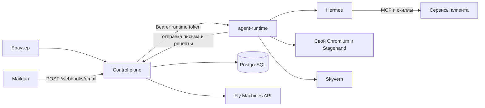

# Архитектура

Два вида процессов. Control plane один на весь продукт. У каждого агента своя машина, и задачи между агентами не стоят в общей очереди.

Hermes не принимает почту и не держит браузер. Он думает, ходит в MCP и пишет скиллы. HTTP рядом с ним — `agent-runtime`: туда control plane кладёт письмо, и оттуда Hermes вызывает браузер.

## Где что исполняется

| | Control plane | Машина агента |
| --- | --- | --- |
| Процесс | `apps/web`, Next.js | два контейнера: `agent-runtime` и Hermes |
| Данные | PostgreSQL | volume `/opt/data` |
| Сеть | публичный HTTPS | runtime слушает приватный `http://<app>.flycast:8787` |
| Секреты провайдеров | Mailgun, Fly, Google OAuth | OpenRouter, Skyvern, токены сервисов этого агента |

Control plane ходит в runtime по приватному адресу Flycast. Снаружи порт runtime не опубликован. Запрос на `.flycast` сам снимает suspend, отдельный `start` не нужен. Уже созданные агенты со старым `http://<app>.internal:8787` по-прежнему будятся через `start`, пока смена модели не перепишет адрес. Обратно runtime ходит на `APP_URL` с тем же bearer-токеном и заголовком `X-Agent-Id`: отправить письмо, записать рецепт или попросить `suspend`.

В локальной разработке вместо `.flycast` подставляется `DEV_RUNTIME_URL`.

## Лестница входа в сервис

Способ входа один на весь продукт: первый агент, разобравшийся с сервисом, пишет рецепт, и все последующие агенты любого клиента получают его в `services.json` и не ищут способ заново. Секрет рабочего пространства — у того агента, который вошёл: соседи по тенанту его не видят и в своих «подключённых сервисах» не показывают.

0. **Онбординг — всегда браузер.** Приглашение принимается и аккаунт под почтой агента заводится только в браузере: Skyvern (runtime передаёт ему коды из писем, он обходит капчи), иначе свой Chromium на машине. Программного пути принять приглашение нет. Логин и пароль сохраняются в секрете агента и видны владельцу в карточке.
1. **MCP.** Если в каталоге уже есть рецепт `kind: mcp`, URL попадает в `config.yaml` Hermes вместе с токеном агента. Инструменты Hermes видит как `mcp_<slug>_<tool>`.
2. **API.** MCP нет — ищется публичный API. Ключ лежит в секрете агента, запросы делает Hermes из терминала.
3. **Браузер.** Нет ни MCP, ни API. Повторный вход — по сохранённому паролю в своём Chromium. Действия внутри сервиса — Stagehand на этом же браузере. Шаги пишутся в журнал. Ролик есть только у сессии Skyvern.

Рецепт не понижается: повторная запись `browser` не затирает уже найденный `mcp`. Домены рецепта только дополняются.

## Границы модулей

Пакеты не знают про Next.js и про Fly-машину друг друга.

- `contracts` — схемы, которые обе стороны могут импортировать.
- `db` и `crypto` — только control plane. Runtime базы продукта не видит.
- `hermes-config` рисует файлы, но не деплоит их.
- `fly` говорит с Machines API и не знает про почту.
- `mail` не знает про агентов: адрес, подпись и нормализация. Кому принадлежит адрес, решает control plane.

Единственное место, которое по очереди зовёт адрес, реестр, Fly и конфиг Hermes, — `apps/web/src/lib/create-agent.ts`.

## Одобрение

Пока у агента выключен флаг «разрешать все действия без человека», изменение в чужой системе (создать, удалить, отправить, оплатить) проходит через `POST /approval` на runtime. Runtime пишет в чат вопрос с кнопками «Да» и «Нет» и, если известен email владельца, отправляет письмо. Кнопка и ответ «да» или «нет» (словом, не моделью) решают одинаково. В автономном режиме runtime сразу отвечает `approved: true`.
